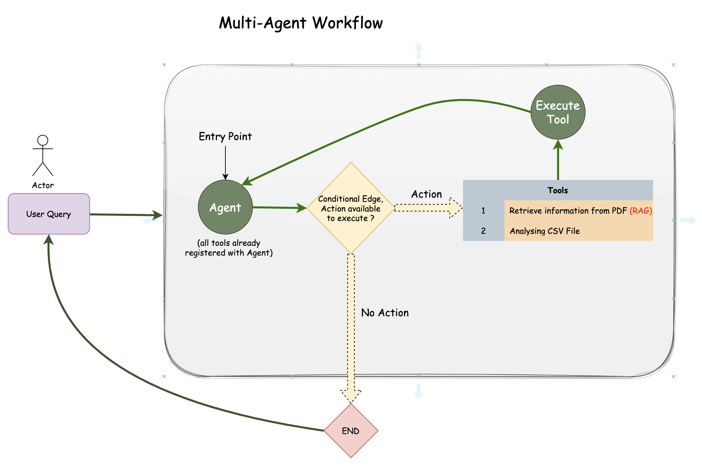

---
# Multi-Agent function calling with LangGraph

## Overview

This project utilizes the `LangChain` and `LangGraph` framework to create a `Multi-Agent` enabled conversational interface for performing various tasks such as analyzing CSV data and extracting information from resumes or portfolios. It employs OpenAI's language models and tools to enable natural language interactions with the system.

## Features

- **Multi-Agent Framework**: Any or all agents is / are triggered based on the user query to generate appropriate response. 
- **CSV Analysis**: Analyze customer data stored in a CSV file to extract relevant insights and information.
- **Resume/Portfolio Extraction**: Extract information related to a specific individual named 'Ankit' from a document or portfolio.
- **Conversational Interface**: Utilize natural language processing capabilities to interact with the system and perform tasks seamlessly.

## Multi-Agent Workflow


**Note**: Each tool is build such that the database is already in place to execute the query so received.

## Dependencies

- **Python**: Make sure you have Python installed on your system.
- **OpenAI**: This project requires access to OpenAI's language models and embeddings.
- **Pandas**: For handling CSV data.
- **Pinecone**: For similarity search functionality.
- **LangChain**: A framework for building conversational agents and workflows.
- **LangGraph**: A framework for building graph including nodes, edges, and conditional edges in the workflow.
- **dotenv**: For loading environment variables from a `.env` file.

## Setup

1. Clone the repository to your local machine:

```bash
git clone https://github.com/AnkitBaliyan1/Multi-Agent-with-LangGraph.git
```

2. Install dependencies:

```bash
pip install -r requirements.txt
```

3. Set up environment variables:

Create a `.env` file in the root directory of your project and add the following variables:

```plaintext
OPENAI_API_KEY='your_openai_api_key'
PINECONE_API_KEY='your_pinecone_api_key'
PINECONE_INDEX_NAME='your_pinecone_index_name'
NAMESPACE='your_namespace'
```

Replace the field as per your use case.

## Usage

1. Run the main script:

```bash
python main.py
```

2. Enter your queries or questions when prompted.

3. View the output generated by the system, which will include responses to your queries based on the implemented functionalities.

## Contributing

Contributions are welcome! If you'd like to contribute to this project, feel free to submit a pull request or open an issue.

## License

This project is licensed under the MIT License - see the [LICENSE](MIT License) file for details.

---
